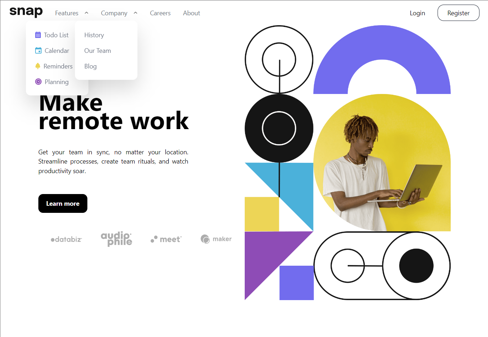
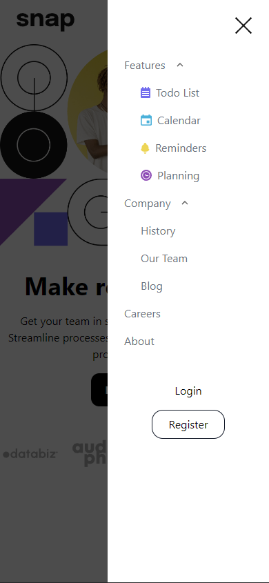

# Frontend Mentor - Intro section with dropdown navigation solution

This is a solution to the [Intro section with dropdown navigation challenge on Frontend Mentor](https://www.frontendmentor.io/challenges/intro-section-with-dropdown-navigation-ryaPetHE5). Frontend Mentor challenges help you improve your coding skills by building realistic projects. 

## Table of contents

- [Overview](#overview)
  - [The challenge](#the-challenge)
  - [Screenshots](#screenshots)
  - [Links](#links)
- [My process](#my-process)
  - [Built with](#built-with)
  - [What I learned](#what-i-learned)
  - [Future development](#future-development-plans)
  - [Useful resources](#useful-resources)
- [Author](#author)
- [Acknowledgments](#acknowledgments)

## Overview

### The challenge

Users should be able to:

- View the relevant dropdown menus on desktop and mobile when interacting with the navigation links
- View the optimal layout for the content depending on their device's screen size
- See hover states for all interactive elements on the page

### Screenshots

### Links

- Live Site URL: [Solution](https://nxtime-intro-section-challenge.netlify.app)

## My process

### Built with

- Semantic HTML5 markup
- Flexbox
- Mobile-first workflow
- [React](https://reactjs.org/) - JS library
- [Typescript](https://www.typescriptlang.org/) - Typos
- [TailwindCSS](https://tailwindcss.com/) - For styles

### Future development plans

Create animated transitions using framer-motion

## Author

- Website - [Marcos Paulo](https://marcospaulo.vercel.app)
- Frontend Mentor - [@yourusername](https://www.frontendmentor.io/profile/nxtime)
- Linkedin - [/in/code-mp](https://www.linkedin/in/code-mp)